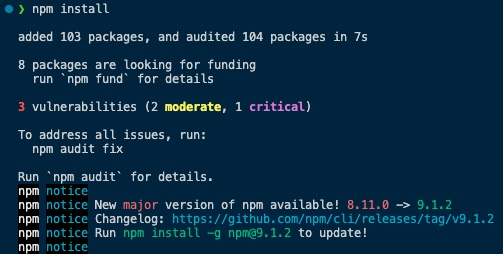

# react-advent-calendar-2022-nina<!-- omit in toc -->

React web app embedding a 2022 Advent calendar illustrating episodes of the relationship between my girlfriend and me.

## Demo link<!-- omit in toc -->

Link to [react-advent-calendar-2022-nina](https://antho1426.github.io/react-advent-calendar-2022-nina/) web app hosted on GitHub Pages.


## Table of contents<!-- omit in toc -->

- [1. Description](#1-description)
- [2. Technologies](#2-technologies)
- [3. Getting started](#3-getting-started)
- [4. Deploying Vite web app to GitHub Pages](#4-deploying-vite-web-app-to-github-pages)
- [5. Program update process](#5-program-update-process)
- [6. Resources](#6-resources)
  - [6.1 Fundamental resources and credits](#61-fundamental-resources-and-credits)
  - [6.2 Additional resources](#62-additional-resources)
- [7. Version history](#7-version-history)
- [8. License](#8-license)

<!-- toc -->

## 1. Description

This project is a React JS application built as an Advent calendar for the month of December 2022. From December 1st to 24th, the user can search and click on the hatch of the day. The hatch will then rotate and reveal a picture of Nina and Anthony's life since the beginning of their story in April 2017 by means of CSS functions. The 24 photos recall some of the key moments of their relationship in a chronological order.

By taking advantage of the browser's `localStorage` object, the state of the returned images is saved locally on the device. Thus, if the user closes the tab or even turns off the browser completely, he will be able to access his calendar again via its URL and will find it exactly in the same state as when he left. Finally, as of December 24, 2022, all hatches will be accessible forever. Until then, only hatches up to the current day can be returned by pressing them. However, because the web application is static, it should be noted that it must be reloaded between each day so that it updates to the current date and access to the next window is unlocked.

This calendar offers an interesting alternative to more traditional physical Advent calendars. Hosted on a public web page on GitHub Pages, this project allowed me to send a digital Advent calendar to my girlfriend who was traveling in Australia during the month of December 2022.


## 2. Technologies

To realize this project, in addition to Typescript, HTML and CSS web languages, I leveraged from a higher perspective following technologies:

- [React JS](https://reactjs.org/): A famous JavaScript library for building user interfaces.
- [Vite](https://vitejs.dev/): A build tool aiming at providing a faster and leaner development experience for modern web projects.
- [GitHub Pages](https://pages.github.com/): A free hosting tool to turn GitHub repositories into elegant websites so they can be shared with anyone on the internet.

## 3. Getting started

As explained in YouTube video "[React Advent Calendar - With Typescript](https://www.youtube.com/watch?v=noyJTgRx32k)", the starter files and finished project initially created by Thomas Weibenfalk can be found at [advanced-react-calendar-2021 GitHub repository](https://github.com/weibenfalk/advanced-react-calendar-2021). Here is the initial setup to get started with a similar project:

1. Download files from [advanced-react-calendar-2021](https://github.com/weibenfalk/advanced-react-calendar-2021) GitHub repository.

2. Go inside the folder "react-calendar-start-here" from the terminal.

3. Type `npm install` to install all the dependencies of the project.

    

4. Then type `npm run dev` to start up the "Vite configuration" that Thomas Weibenfalk created for starting with this project.

## 4. Deploying Vite web app to GitHub Pages

In order to host my web app on GitHub Pages, I followed the instructions from YouTube video "[How to Deploy Your Vite App to Github Pages](https://www.youtube.com/watch?v=yo2bMGnIKE8)". The method described here consists in creating a separate "gh-pages" branch in the repository of the project in order to dedicate it to the GitHub Pages website. The end goal for this branch is to contain just the build folder called "/dist". The key is to make this branch a subtree of the main branch. This method allows to put the "/dist" folder in its own repository. Here are the steps to achieve this:

1. Create a project repository on GitHub as shown [here](https://docs.github.com/en/get-started/quickstart/create-a-repo).

2. Then, link your code on your computer to this remote repository by creating a main branch with following set of commands at the root of your project as shown [here](https://docs.github.com/en/get-started/importing-your-projects-to-github/importing-source-code-to-github/adding-locally-hosted-code-to-github):

    ```bash
    git init
    git add .
    git commit -m "First commit"
    git branch -M main
    git remote add origin https://github.com/<my-github-profile-name>/<my-repository-name>.git
    git push -u origin main
    ```

    After pushing, the code should be visible in the GitHub repository you just created and corresponding to following URL: "https://github.com/\<my-github-profile-name>/\<my-hosted-repository-name>.git".

3. Now in order to actually start deploying the web app, files have to be accessed like "https://\<my-github-profile-name>.github.io/\<my-hosted-repository-name>/" . For this, the Vite config file situated at the root of the project and called "vite.config.js" has to be changed in the following way in order to set the base URL of the repository:

    Initial configuration:

    ```javascript
    import { defineConfig } from 'vite'
    import react from '@vitejs/plugin-react'

    // https://vitejs.dev/config/
    export default defineConfig({
        plugins: [react()]
    })
    ```

    Final configuration:

    ```javascript
    import { defineConfig } from 'vite'
    import react from '@vitejs/plugin-react'

    // https://vitejs.dev/config/
    export default defineConfig({
        base: '/<my-hosted-repository-name>/',
        plugins: [react()]
    })
    ```

    This will route all static assets through this base URL.

4. Now that Vite is configured, it is possible to build the Vite project with `npm run build` command. This will build the Vite project into folders that can be served and deployed.

<a id="commands_for_subtree"></a>

5. Run following git commands to get the "/dist" folder into the "gs-pages" subtree:

    ```bash
    git add dist -f  # "-f" is required because Vite's default ".gitignore" ignores "/dist" folder; because we want it in our subtree, we need to override that
    git commit -m "Adding /dist folder"
    git subtree push --prefix dist origin gh-pages  # this make "gh-pages" a subtree of our main branch; the "--prefix" option specifies the folder that we want for your "gh-pages"
    ```

6. Now take a look at your "gh-pages" branch in your repository on GitHub. This branch will basically contain just the root of the "/dist" folder. This is exactly what we want because when GitHub Pages serves this folder our "index.html" file will be found at the root.

7. That's it! 🎉 In a few minutes, GitHub pages should refresh with the newest repository changes and we will be able to see our React web app project online. If we want to see exactly what is happening and being served in real time, we can go to the "Settings" tab of our repository on GitHub under the "Pages" section. Once this online build process is finished, we can click the link of our web app hosted on GitHub Pages and head over to our site. If we look at the URL, we can see that it is effectively deployed on "gitHub.io" under the form "https://\<my-github-profile-name>.github.io/\<my-hosted-repository-name>/", which in my case is "https://antho1426.github.io/react-advent-calendar-2022-nina/".

## 5. Program update process

In order to progressively adapt the original software of Thomas Weibenfalk to the Advent calendar I wanted to obtain, I had to update and test my code many times. Here are the steps I followed in order to iteratively build, test and launch the web app:

1. First, make changes to the code 🛠️.

2. Then build the code with `npm run build`.

3. Check that everything is fine by launching an instance of the web app on a local development server with `npm run dev`. This command is used to run the dev script defined inside the "package.json" file at the root of the project. Alternatively, one could specify the port number on which the app has to run. This can be achieved as explained at "[Stack Overflow - How npm start runs a server on port 8000](https://stackoverflow.com/questions/24750253/how-npm-start-runs-a-server-on-port-8000)". The command would then be for instance `npm run dev -- --port 3001` to launch a local development server on port "3001".

4. Once manual testing is done, exit `npm run dev` by hitting "Ctrl" + "C" in your terminal window and optionally check the last changes you brought to your GitHub repository with `git status`.

5. Add and commit your changes on the "main" branch with following set of commands:

    ```bash
    git add .
    git commit -m "Comment to identify changes brought with this commit"
    git push
    ````

6. Finally, as explained in <a href="#commands_for_subtree">point "5."</a> of section , add changes to "gh-pages" subtree. This will allow, among others, to update the content of the "/dist" folder generated at build time. The set of commands to type are following:

    ```bash
    git add dist -f
    git commit -m "Comment to identify changes brought with this commit among others in the dist folder"
    git subtree push --prefix dist origin gh-pages
    ```

7. From this point, after waiting for a couple of minutes, the new state of the web app should be available on GitHub Pages at its dedicated URL.

## 6. Resources

### 6.1 <u>Fundamental</u> resources and credits

- **Thomas Weibenfalk**'s GitHub repository I took inspiration from for creating this React Advent calendar: ["weibenfalk/advanced-react-calendar-2021"](https://github.com/weibenfalk/advanced-react-calendar-2021) (corresponding YouTube video can be found at "[React Advent Calendar - With Typescript](https://www.youtube.com/watch?v=noyJTgRx32k)").
- YouTube video I watched to discover how to host a React web app based on the Vite build tool on GitHub Pages: "[How to Deploy Your Vite App to Github Pages](https://www.youtube.com/watch?v=yo2bMGnIKE8)".
- [HTML Color Codes](https://htmlcolorcodes.com/) reference.
- [PNG to JPG](https://png2jpg.com/) conversion tool.

### 6.2 Additional resources

What helped:

- Another YouTube video for additional inspiration in case the first project did not work out in time: "[Building an Advent Calendar with JavaScript, HTML & CSS](https://www.youtube.com/watch?v=KXPD11CQLGE)".
- [Stack Overflow - How to fix production 404 error on images' imports](https://stackoverflow.com/questions/73281331/how-to-fix-production-404-error-on-images-imports).
- [Stack Overflow - HTML5 Local storage vs. Session storage](https://stackoverflow.com/questions/5523140/html5-local-storage-vs-session-storage).

What didn’t help in the end:

- YouTube video "[Host React.js App for FREE in 5 mins with GitHub Pages](https://youtu.be/2hM5viLMJpA)".
- "[Stack Overflow - Error with Permissions-Policy header: Unrecognized feature: 'interest-cohort'](https://stackoverflow.com/questions/69619035/error-with-permissions-policy-header-unrecognized-feature-interest-cohort)".
- "[Create React App - Deployment - Github Pages](https://create-react-app.dev/docs/deployment/#github-pages)".
- "[Towards Dev - Deploying React Application to Github Pages with Vite](https://towardsdev.com/deploying-react-application-to-github-pages-with-vite-2d3e32ae97e7)".
- "[Vite - Deploying a Static Site - GitHub Pages](https://vitejs.dev/guide/static-deploy.html#github-pages)".
- "[Stack Overflow - Github pages vite JS build not showing the images
](https://stackoverflow.com/questions/68758939/github-pages-vite-js-build-not-showing-the-images)".

## 7. Version history

+ 0.1
  + Initial release


## 8. License

MIT License @ Anthony Guinchard.